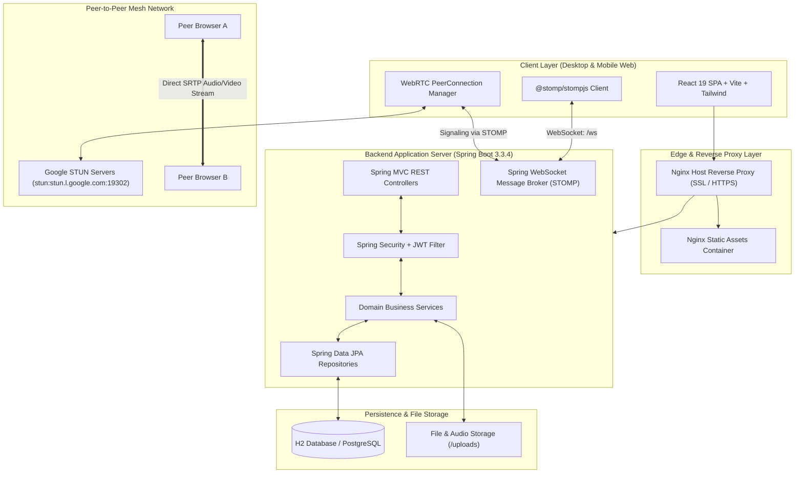
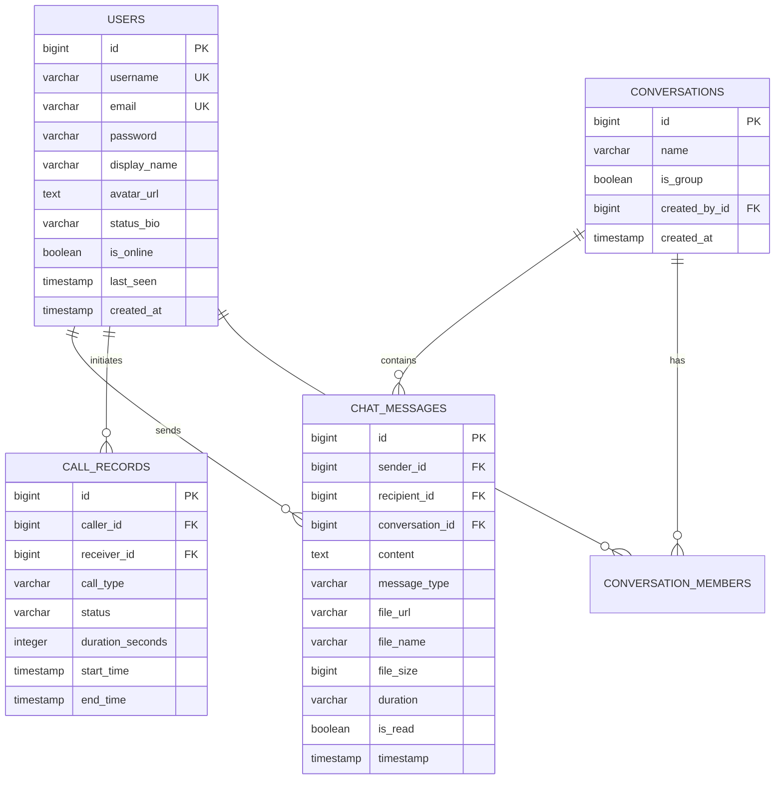
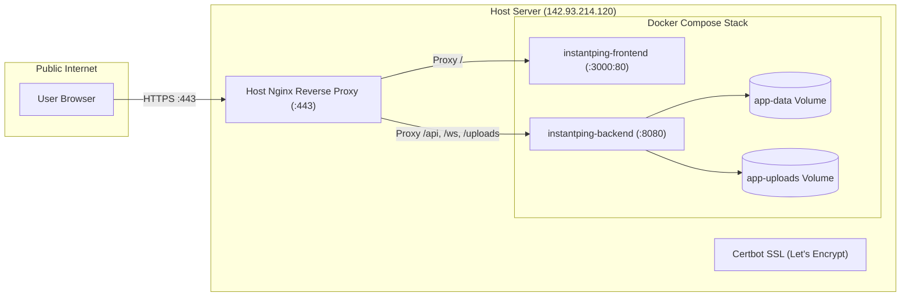

# 🏗️ InstantPing - System Architecture & Technical Design

## 1. High-Level Architectural Overview

InstantPing is architected as a distributed real-time communication platform combining **Stateless RESTful APIs**, **Full-Duplex STOMP over WebSocket Channels**, and **Peer-to-Peer WebRTC Mesh Media Pipelines**.



---

## 2. Layered Component Architecture

### 2.1 Client Layer (Frontend)
- **Framework**: React 19 SPA bundled with Vite 6.
- **Styling**: Tailwind CSS with custom dark slate palette and glassmorphism.
- **State Management**: React Context (`AuthContext`, `CallContext`, `ChatContext`) with reactive custom hooks.
- **Real-Time Client**: `@stomp/stompjs` + `sockjs-client` providing automatic exponential backoff reconnection.
- **Media Engine**: Native WebRTC `RTCPeerConnection`, `MediaRecorder` API for voice notes, and `getUserMedia` for video/audio streams.

### 2.2 Real-time Messaging & Signaling Layer (STOMP over WebSocket)
The application establishes a persistent bidirectional WebSocket connection at endpoint `/ws`.

#### STOMP Topics & Destinations:
| Destination Channel | Type | Purpose |
| :--- | :--- | :--- |
| `/topic/messages` | Broadcast | Public chat messages and broadcast alerts |
| `/topic/public` | Broadcast | Global presence and user online/offline status |
| `/queue/messages` | User Queue | Direct 1-on-1 private messaging |
| `/queue/typing` | User Queue | Real-time typing indicators |
| `/queue/call-signal` | User Queue | WebRTC ICE candidates and SDP Offer/Answer signaling |
| `/queue/group-call-signal` | User Queue | Multi-party mesh video call coordination |
| `/queue/call-action` | User Queue | Remote call controls (end call, mute, reject) |

---

## 3. WebRTC Peer-to-Peer Calling Protocol

InstantPing implements a decentralized **Full-Mesh WebRTC** topology for both 1-on-1 calls and multi-party video conferencing.

```mermaid
sequenceDiagram
    autonumber
    actor Caller as Caller (Peer A)
    participant Server as Spring STOMP Signaling
    actor Callee as Callee (Peer B)

    Caller->>Server: SEND /app/call.offer { target: "Peer B", sdp: offerSDP }
    Server->>Callee: FORWARD /queue/call-signal { type: "OFFER", caller: "Peer A" }
    Note over Callee: Callee phone rings (Audio alert)
    Callee->>Server: SEND /app/call.answer { target: "Peer A", sdp: answerSDP }
    Server->>Caller: FORWARD /queue/call-signal { type: "ANSWER", callee: "Peer B" }
    
    par ICE Candidate Exchange
        Caller->>Server: SEND /app/call.ice-candidate { candidate }
        Server->>Callee: FORWARD /queue/call-signal { candidate }
    and
        Callee->>Server: SEND /app/call.ice-candidate { candidate }
        Server->>Caller: FORWARD /queue/call-signal { candidate }
    end

    Note over Caller, Callee: Direct P2P SRTP Media Connection Established
    Caller==>>Callee: Real-time Audio / Video / Screen Share Data
```

---

## 4. Data Model & Database Schemas



---

## 5. Production Infrastructure & Deployment Topology



---

## 6. Security Architecture

1. **Authentication**: Stateless HMAC-SHA256 JWT tokens passed via `Authorization: Bearer <token>` headers.
2. **Password Hashing**: BCrypt with work factor 10.
3. **CORS & Origin Validation**: Strict origin validation supporting localhost and `https://chat.kanchan.online`.
4. **OAuth 2.0 Identity**:
   - Google Identity Services (GIS) / Token Client protocol.
   - GitHub OAuth code exchange with token authorization.
5. **Transport Security**: TLS 1.3 encryption across all HTTPS and WSS connections.
