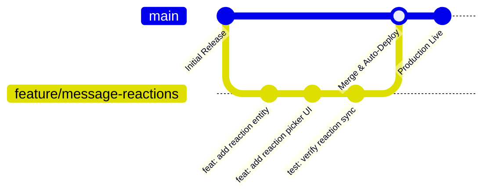
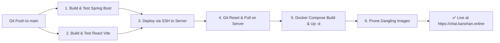

# 🛠️ InstantPing - Development, Testing & CI/CD Workflow

This document outlines the standard development cycle, local testing guidelines, branching strategies, and automated deployment procedures for **InstantPing**.

---

## 1. 💻 Local Environment Setup

### 1.1 Prerequisites
- **Java**: JDK 21+ (`F:\JDK` or standard system JDK)
- **Build Tool**: Maven 3.9+ (or Maven Wrapper `mvnw`)
- **Node.js**: Node 20+ and npm 10+
- **Git**: Git 2.40+

### 1.2 Starting the Backend Locally
```powershell
cd backend
$env:JAVA_HOME = "F:\JDK"   # adjust to your JDK path if needed
mvn spring-boot:run
```
- **Backend API**: `http://localhost:8080`
- **H2 Database Console**: `http://localhost:8080/h2-console` (JDBC URL: `jdbc:h2:file:./data/chatdb`, User: `sa`, Password: empty)

### 1.3 Starting the Frontend Locally
```powershell
cd frontend
npm install
npm run dev
```
- **Frontend App**: `http://localhost:5173`

### 1.4 Environment Configuration (`frontend/.env`)
Create `frontend/.env` based on `frontend/.env.example`:
```env
VITE_GOOGLE_CLIENT_ID=your_google_dev_client_id.apps.googleusercontent.com
VITE_GITHUB_CLIENT_ID=your_github_dev_client_id
```

---

## 2. 🌿 Git Branching & Progressive Feature Strategy

To ensure stability and prevent breaking changes in production, all new features follow a structured branching workflow:



### 2.1 Standard Step-by-Step Flow

#### Step 1: Create a Feature Branch from `main`
```bash
git checkout main
git pull origin main
git checkout -b feature/<feature-name>
# Example: git checkout -b feature/message-reactions
```

#### Step 2: Implement Changes Locally
- Modify files in small, cohesive increments.
- Maintain documentation integrity and clean code structure.

#### Step 3: Run Local Build & Verification Checks
Before committing, verify both frontend and backend build with zero errors:
```powershell
# Verify Backend Compilation
cd backend
mvn test-compile

# Verify Frontend Production Build
cd ../frontend
npm run build
```

#### Step 4: Commit with Conventional Messages
```bash
git add .
git commit -m "feat(chat): add emoji reaction picker and real-time STOMP sync"
```

#### Step 5: Test Locally with Multiple Browser Windows
- Open `http://localhost:5173` in Chrome normal window (User A).
- Open `http://localhost:5173` in Incognito window (User B).
- Test messaging, media upload, and calling between User A and User B.

#### Step 6: Merge to `main` & Deploy
When the feature is verified and approved:
```bash
git checkout main
git merge feature/<feature-name>
git push origin main
```
> [!IMPORTANT]
> **Always confirm with the team before running `git push origin main`**, as pushing to `main` triggers the automated GitHub Actions production deployment.

---

## 3. 🚀 CI/CD Pipeline & Automated Deployment

InstantPing uses a continuous integration and continuous deployment pipeline configured in [`.github/workflows/deploy.yml`](../.github/workflows/deploy.yml).

### 3.1 Pipeline Stages



1. **Build Verification (CI)**:
   - Validates JDK 21 and compiles the Spring Boot backend with Maven.
   - Sets up Node 20 and compiles the React Vite frontend bundle.
2. **Production Deployment (CD)**:
   - Authenticates via secure SSH key to the production server (`142.93.214.120`).
   - Resets and syncs code with `git reset --hard origin/main`.
   - Executes `docker compose up --build -d` to rebuild and launch the updated frontend and backend containers.
   - Cleans up older Docker layers to maintain disk health.

---

## 4. 🔄 Server Rollback Strategy

In the rare event that an issue occurs in production:

1. **Revert the commit locally**:
   ```bash
   git revert HEAD
   git push origin main
   ```
2. **Or rollback directly on the host server**:
   ```bash
   ssh root@142.93.214.120
   cd ~/instantping
   git reset --hard <previous-stable-commit-hash>
   docker compose up --build -d
   ```
