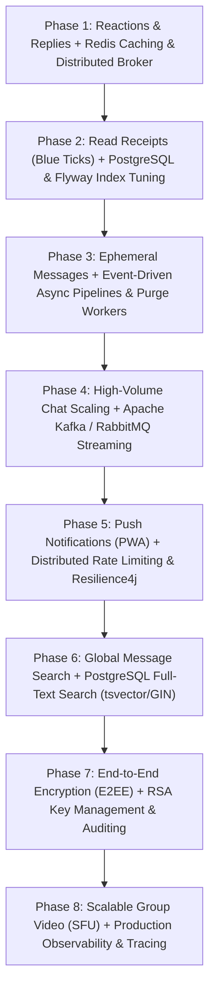

# 🗺️ InstantPing - Balanced Full-Stack & Backend Mastery Roadmap

This roadmap strikes the balance between **delivering feature-rich consumer app capabilities** (like WhatsApp / Discord / Slack) and **mastering advanced backend engineering & distributed systems architecture** (Spring Boot, Redis, PostgreSQL, Kafka, Resilience, Observability, E2EE).

Each phase is self-contained: it adds a user-facing product feature paired with a foundational backend architectural upgrade, developed on its own branch, tested locally, and deployed via CI/CD.

---

## 🎯 The Balanced Evolution Plan

---

## 📦 Phase 1: Message Reactions, Threaded Replies & Redis Distributed Broker

### 🌟 Product Feature (UI/UX)
- **Emoji Reactions**: Hover/long-press reaction quick-bar (👍, ❤️, 😂, 😮, 😢, 🙏) on any message with real-time reaction counter badges.
- **Threaded Replies & Quotes**: Quote any message to reply in context with interactive "jump to original message" scroll.

### ⚙️ Deep Backend Engineering
- **Redis STOMP Broker Relay**: Replace Spring's in-memory `SimpleBroker` with an external Redis Pub/Sub STOMP broker relay to support multi-instance horizontal scaling.
- **Distributed Presence & Caching**: Track user online/offline status with Redis TTL heartbeats; cache conversation rosters with `@Cacheable` and automatic cache eviction.
- **Database Schema**: Add `MessageReaction` entity and self-referencing `parent_message_id` FK on `ChatMessage`.
- **Branch**: `feature/message-reactions-and-replies`
---

## 📦 Phase 2: Read Receipts (Double Blue Ticks) & PostgreSQL Migration with Flyway

### 🌟 Product Feature (UI/UX)
- **Live Delivery Lifecycle Status**:
  - 🕒 Sending (Local queue)
  - ✓ Single Grey Tick (Saved on server)
  - ✓✓ Double Grey Ticks (Delivered to recipient device)
  - ✓✓ Double Blue Ticks (Read by recipient in active viewport)

### ⚙️ Deep Backend Engineering
- **Production PostgreSQL 16**: Migrate from embedded H2 to PostgreSQL container in `docker-compose.yml`.
- **Flyway Versioned Migrations**: SQL migration scripts (`V1__init_schema.sql`, `V2__add_indexes.sql`) for reproducible deployments.
- **JPA Performance Tuning**: Eliminate N+1 query bottlenecks using `@EntityGraph` and `JOIN FETCH`. Add composite B-Tree indexes on `(conversation_id, timestamp DESC)` and `(recipient_id, is_read)`.
- **Batch Read Receipt Sync**: Batch WebSocket endpoint `/app/chat.read` reducing database write load.
- **Branch**: `feature/read-receipts-and-postgres-migration`

---

## 📦 Phase 3: Ephemeral Messages & Asynchronous Event-Driven Pipelines

### 🌟 Product Feature (UI/UX)
- **Disappearing Messages**: Per-chat toggle to auto-expire messages after 24 hours or 7 days.
- **View-Once Media**: Photos/audio notes that blur out and lock immediately after viewing.

### ⚙️ Deep Backend Engineering
- **Domain Event-Driven Architecture**: Spring `ApplicationEventPublisher` with `@TransactionalEventListener(phase = AFTER_COMMIT)` decoupling message delivery from audit logs and side-effects.
- **Asynchronous Thread Pool Worker**: Custom `ThreadPoolTaskExecutor` for background media compression, thumbnail generation, and audio waveform extraction.
- **Scheduled Purge Worker**: Spring `@Scheduled` cron job that securely deletes expired media files from physical disk and soft-deletes expired records in paginated batches.
- **Branch**: `feature/phase3-ephemeral-async-events`

---

## 📦 Phase 4: Message Queue Streaming with Apache Kafka or RabbitMQ

### 🎯 Product Feature (UI/UX)
- **High-Throughput Group Broadcasts**: Support channels with hundreds of simultaneous members with zero lag or UI freeze.

### ⚙️ Deep Backend Engineering
- **Decoupled Producer-Consumer Architecture**: Chat messages are published directly to a high-throughput queue (`chat-messages-topic`) before database persistence.
- **Backpressure & Batch Persistence**: Background worker consumers batch incoming messages and persist them to PostgreSQL in bulk (reducing DB write IOPS by 80%).
- **Dead Letter Queue (DLQ)**: Robust error handling with exponential retry backoff for unprocessable messages.
- **Branch**: `feature/kafka-message-streaming`

---

## 📦 Phase 5: PWA, Web Push Notifications & Distributed Rate Limiting

### 🌟 Product Feature (UI/UX)
- **Progressive Web App (PWA)**: Installable on Windows, macOS, Android, and iOS with home screen icon and offline support.
- **System Push Notifications**: Native OS notifications for incoming messages and calls even when the browser tab is closed.

### ⚙️ Deep Backend Engineering
- **VAPID Web Push Protocol**: Backend Web Push dispatcher using Spring WebClient sending encrypted push payloads to browser push endpoints.
- **Distributed Token Bucket Rate Limiting**: Implement **Bucket4j + Redis** to throttle API requests (e.g. max 15 requests/sec) and prevent message flooding or DDoS.
- **Resilience4j Circuit Breakers**: Wrap external OAuth providers (Google, GitHub) and push servers in circuit breakers with graceful fallbacks.
- **Branch**: `feature/pwa-and-push-notifications`

---

## 📦 Phase 6: Global Message Search with Full-Text Engine

### 🌟 Product Feature (UI/UX)
- **Unified Global Search**: Search bar with real-time fuzzy matching across all chats, contacts, media attachments, and links.
- **Search Result Highlighting**: Highlight matched keywords with 1-click jump directly to the exact point in the message history.

### ⚙️ Deep Backend Engineering
- **PostgreSQL Full-Text Search Engine**: Implement `tsvector` document generators, `tsquery` stemming, and GIN (Generalized Inverted Index) indexing.
- **Fuzzy Search & Relevance Ranking**: `pg_trgm` trigram similarity matching for misspelled words with ranked relevance scoring (`ts_rank`).
- **Branch**: `feature/fulltext-search-engine`

---

## 📦 Phase 7: End-to-End Encryption (E2EE) & Enterprise Security

### 🌟 Product Feature (UI/UX)
- **E2EE Badge & Safety Number**: "🔒 Messages are end-to-end encrypted" security indicator with QR code safety number verification between contacts.

### ⚙️ Deep Backend Engineering
- **Cryptographic Key Management**: Server acts as a zero-knowledge identity key store storing public Identity & Pre-Keys (X3DH Key Agreement Protocol).
- **Asymmetric RS256 JWT Security**: Upgrade backend authentication to RSA Public/Private Keypair OAuth2 Resource Server.
- **Method-Level Security**: Granular `@PreAuthorize` permission evaluators verifying user access on every protected resource.
- **Branch**: `feature/e2ee-encryption-and-security`

---

## 📦 Phase 8: Scalable Group Video (SFU) & Production Observability

### 🌟 Product Feature (UI/UX)
- **Large-Scale Video Conferences**: Multi-user grid supporting 20+ video participants with active speaker spotlighting and dynamic screen sharing.

### ⚙️ Deep Backend Engineering
- **SFU Media Server Integration**: Selective Forwarding Unit (**LiveKit / mediasoup**) managing simulcast audio/video streams alongside Spring Boot.
- **Prometheus & Grafana Observability**: Export JVM memory, HikariCP connection pool stats, WebSocket frame throughput, and HTTP latencies to `/actuator/prometheus`.
- **Distributed Tracing & MDC Logging**: Correlate every HTTP request and WebSocket message with unified `traceId` / `spanId` in SLF4J MDC.
- **Branch**: `feature/sfu-group-video-and-observability`

---

## 📊 Complete Balance Matrix

| Phase | User-Facing Product Feature | Core Backend Engineering Deep-Dive |
| :--- | :--- | :--- |
| **Phase 1** | Message Reactions & Threaded Replies | Redis Pub/Sub STOMP Broker Relay & TTL Presence Caching |
| **Phase 2** | Read Receipts (Double Blue Ticks) | PostgreSQL 16, Flyway Versioned Migrations, JPA Query Tuning |
| **Phase 3** | Disappearing Messages & Ephemeral Media | Domain Events (`@TransactionalEventListener`), Async Pools & Cron Purge |
| **Phase 4** | Large Channel Multi-User Scaling | Apache Kafka / RabbitMQ Streaming, Batch Consumer & DLQ |
| **Phase 5** | PWA & Native OS Web Push Notifications | Web Push API, Bucket4j Distributed Rate Limiter & Resilience4j |
| **Phase 6** | Global Search & Keyword Highlighting | PostgreSQL Full-Text Search (`tsvector`, GIN index, `pg_trgm`) |
| **Phase 7** | End-to-End Encryption (E2EE) & QR Safety | Web Crypto X3DH Key Store, RS256 RSA JWT & Method Security |
| **Phase 8** | 20+ Person SFU Group Video Calling | SFU Media Server Integration, Prometheus/Grafana & MDC Tracing |
